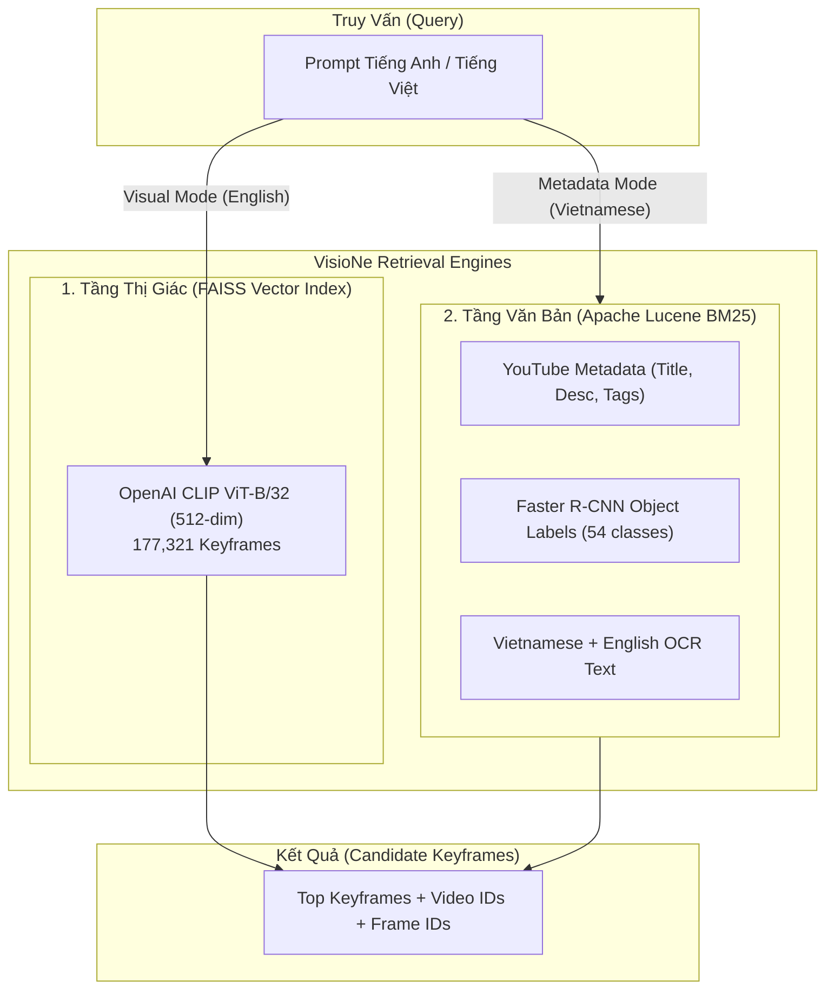

# 🚀 AIC-VisioNe: Hệ Thống Truy Vấn Video Đa Phương Thức (AIC 2026)

Hệ thống truy vấn video thông minh được tối ưu hóa cho cuộc thi **AI Challenge (AIC 2026)** và các đấu trường Video Retrieval (VBS / DRES), xây dựng trên nền tảng **VisioNe Core**. Hệ thống kết hợp tìm kiếm đa phương thức: **OpenAI CLIP ViT-B/32 Vector Search**, **Apache Lucene BM25** hỗ trợ tiếng Việt có dấu, nhãn nhận diện vật thể **Faster R-CNN**, và dữ liệu văn bản trích xuất tự động **Vietnamese OCR** trên toàn bộ 874 video (177,321 keyframes).

---

## 📑 MỤC LỤC
1. [Kiến Trúc Đa Phương Thức (Multimodal Architecture)](#1-kiến-trúc-đa-phương-thức)
2. [Cấu Trúc Thư Mục Dữ Liệu Chuẩn](#2-cấu-trúc-thư-mục-dữ-liệu-chuẩn)
3. [Cấu Trúc Repository & Bộ Công Cụ (Tools & Solutions)](#3-cấu-trúc-repository--bộ-công-cụ)
4. [Hướng Dẫn OCR Toàn Bộ Dataset (Batch OCR Pipeline)](#4-hướng-dẫn-ocr-toàn-bộ-dataset)
5. [Quy Trình Nhúng Dataset Vào VisioNe (Từ A đến Z)](#5-quy-trình-nhúng-dataset-vào-visione)
6. [Khởi Động & Vận Hành Hệ Thống](#6-khởi-động--vận-hành-hệ-thống)
7. [Chiến Lược Query & Mẹo Thi Đấu Đỉnh Cao](#7-chiến-lược-query--mẹo-thi-đấu-đỉnh-cao)

---

## 1. KIẾN TRÚC ĐA PHƯƠNG THỨC

Hệ thống kết hợp **2 tầng tìm kiếm bổ trợ nhau**:



---

## 2. CẤU TRÚC THƯ MỤC DỮ LIỆU CHUẨN

Dữ liệu ban đầu từ Ban Tổ Chức (đặt tại thư mục dữ liệu quy ước, ví dụ `data/AIC2026/`):

```
data/AIC2026/
├── Keyframes_L21/ ... Keyframes_L30/   # 177,321 ảnh keyframe (.jpg)
│   └── keyframes/<video_id>/<stem>.jpg
├── clip-features-32/                   # Vector CLIP ViT-B/32 (.npy)
├── media-info/                         # 874 file JSON thông tin YouTube
├── objects/                            # 874 thư mục nhãn Faster R-CNN (.json)
├── map-keyframes/                      # 874 file CSV mapping frame_idx <-> timestamp
└── video/                              # 874 video MP4 gốc
```

---

## 3. CẤU TRÚC REPOSITORY & BỘ CÔNG CỤ

Repository bao gồm toàn bộ mã nguồn cấu hình, tài liệu giải đề và công cụ tự động hóa:

```
AIC-visione/
├── config.yaml                         # Cấu hình chính của VisioNe Core & các tầng tìm kiếm
├── aic-video-ids.txt                   # Danh sách 874 Video ID của dataset AIC
├── aic-visione-frame-map.csv           # Bản đồ ánh xạ Keyframe Stem <-> Frame Index
├── faiss-idmap_clip-openai.txt         # ID Map cho FAISS Vector Index
├── lucene-documents/                   # 874 file JSONL nén chứa Metadata + Object + OCR
├── ocr-results/                        # 874 file JSONL nén kết quả Vietnamese OCR
├── QUERIES_P2_SOLUTIONS.md             # Bảng đáp án & ground truth chi tiết 36 câu Part 2
├── QUERIES_TRANSLATED_ENG.md           # Bộ prompt tiếng Anh tối ưu cho các câu Part 1
├── tools/
│   ├── solve_all_36_queries.py         # Script tự động giải 36 truy vấn Part 2
│   ├── extract_dataset_ocr.py          # Pipeline OCR tự động bằng GPU kèm checkpoint
│   ├── enrich_lucene_with_objects.py   # Nhúng nhãn Faster R-CNN vào tài liệu Lucene
│   ├── search_ocr_all.py               # Tìm kiếm nhanh từ khóa OCR trên toàn bộ dataset
│   ├── scan_remaining_ocr.py           # Quét tập trung từ khóa OCR cho các câu hỏi khó
│   └── aic_temporal_resolver.py        # Module xử lý truy vấn chuỗi thời gian (TRAKE)
└── docs/
    └── DATASET_INTEGRATION_GUIDE.md    # Hướng dẫn chi tiết quy trình nhúng dữ liệu
```

---

## 4. HƯỚNG DẪN OCR TOÀN BỘ DATASET

Pipeline OCR tự động tại `tools/extract_dataset_ocr.py` hỗ trợ:
- **Tự động lưu checkpoint:** Xử lý xong video nào lưu ngay video đó (`ocr-results/<video_id>-ocr.jsonl.gz`). Nếu bị ngắt, chạy lại sẽ tự động tiếp tục mà không tốn công chạy lại từ đầu.
- **Lọc độ tin cậy (Confidence threshold):** Tự động loại bỏ rác/nhiễu ký tự.
- **Tự động gộp vào Lucene:** Gắn toàn bộ chữ tiếng Việt vào chỉ mục Lucene.

### 💻 Cách chạy OCR:

#### Cách 1: Chạy nền toàn bộ 874 video
```bash
python tools/extract_dataset_ocr.py --gpu 0
```

#### Cách 2: Chạy ưu tiên theo từng tập video (ví dụ bản tin thời sự `L21`, `L22`, `L30` nhiều chữ nhất)
```bash
python tools/extract_dataset_ocr.py --prefix L21 --gpu 0
python tools/extract_dataset_ocr.py --prefix L22 --gpu 0
python tools/extract_dataset_ocr.py --prefix L30 --gpu 0
```

#### Cách 3: Re-index Lucene sau khi OCR xong
Sau khi trích xuất xong, chạy lệnh sau để Lucene nạp toàn bộ chữ OCR mới:
```bash
# 1. Build lại Lucene index
docker run --rm -v $(pwd):/data visione/lucene-index-manager \
  /data/lucene-index add --force /data/lucene-documents/{video_id}/{video_id}-lucene-docs.jsonl.gz \
  --video-ids-list-path /data/aic-video-ids.txt

# 2. Khởi động lại container Core để nhận index mới
docker restart aic-visione-core-1
```

---

## 5. QUY TRÌNH NHÚNG DATASET VÀO VISIONE (TỪ A ĐẾN Z)

Nếu có một đợt phát hành dữ liệu mới, quy trình chuẩn gồm các bước sau:

### Bước 1: Chuẩn bị danh sách Video ID & Frame Map
```bash
ls path/to/media-info | sed "s/.json//" > aic-video-ids.txt
```

### Bước 2: Nhúng nhãn Object Detections & Metadata vào Lucene Documents
Chạy script làm giàu dữ liệu để gắn nhãn song ngữ (xe đạp/bicycle, thuyền/boat, chim/bird...):
```bash
python tools/enrich_lucene_with_objects.py
```

### Bước 3: Chạy OCR tiếng Việt
```bash
python tools/extract_dataset_ocr.py --gpu 0
```

### Bước 4: Xây dựng FAISS Index & Lucene Index
```bash
# Build Lucene Index
docker run --rm -v $(pwd):/data visione/lucene-index-manager \
  /data/lucene-index add --force /data/lucene-documents/{video_id}/{video_id}-lucene-docs.jsonl.gz \
  --video-ids-list-path /data/aic-video-ids.txt

# Build FAISS Index (cho CLIP ViT-B/32)
docker run --rm -v $(pwd):/data visione/faiss-index-manager \
  python build.py --config-file /data/config.yaml /data/faiss-index_clip-openai.faiss /data/faiss-idmap_clip-openai.txt create /data/features-clip-openai
```

---

## 6. KHỞI ĐỘNG & VẬN HÀNH HỆ THỐNG

Khởi chạy máy chủ tìm kiếm VisioNe:
```bash
visione serve -p 8000
```
- **Web UI:** Mở trình duyệt tại `http://localhost:8000`
- **Kiểm tra tìm kiếm Tiếng Việt có dấu:** Thử gõ `Nguyễn Trung Trực`, `FANA Khánh Hòa`, `đua xe đạp`, `bánh crepe`.
- **Kiểm tra tìm kiếm CLIP:** Thử gõ `four astronauts in black spacesuits`, `drone view bicycle race finish line`.

---

## 7. CHIẾN LƯỢC QUERY & MẸO THI ĐẤU ĐỈNH CAO

| Dạng Câu Hỏi | Chiến Lược Tối Ưu | Ví Dụ Điển Hình |
| :--- | :--- | :--- |
| **Địa danh / Tên người / Văn hóa VN** | Dùng `Media Info` (gõ tiếng Việt có dấu hoặc không dấu) | `Nguyễn Trung Trực`, `chùa Tam Chúc`, `lễ hội Ka Tê` |
| **Bảng hiệu / Chữ trên màn hình / Q&A số liệu** | Dùng `Media Info` (OCR + Metadata) | `CLB FANA`, `công thức nấu ăn`, `bản tin giá xăng` |
| **Thể thao / Hành động / Góc quay Flycam** | Dùng `AIC CLIP ViT-B/32` (tả góc quay + bố cục) | `top down aerial view cyclists in straight line` |
| **TRAKE (Chuỗi nhiều sự kiện trong 1 video)** | Dùng CLIP/Media Info tìm **Video ID trước**, sau đó xác định chính xác timestamp **E1, E2, E3, E4** | `múa lân mai hoa thung`, `giải cúp chợ lớn` |

---
*Tài liệu và mã nguồn được phát triển phục vụ cuộc thi AI Challenge 2026.*
