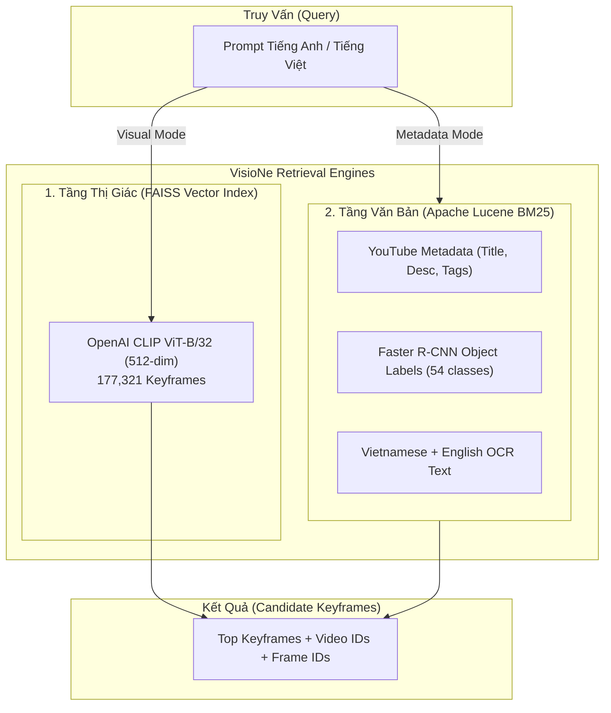

# 🚀 HƯỚNG DẪN TOÀN DIỆN: NHÚNG DATASET & TRÍCH XUẤT OCR CHO AIC / VISIONE

Tài liệu này hướng dẫn chi tiết từ A-Z cách quản lý dữ liệu, nhúng đặc trưng đa phương thức (CLIP, Objects, Metadata, OCR) vào hệ thống **VisioNe**, và quy trình vận hành tối ưu cho cuộc thi Video Retrieval (AIC / VBS / DRES).

---

## 📑 MỤC LỤC
1. [Kiến Trúc Đa Phương Thức (Multimodal Architecture)](#1-kiến-trúc-đa-phương-thức)
2. [Cấu Trúc Thư Mục Dữ Liệu Chuẩn](#2-cấu-trúc-thư-mục-dữ-liệu-chuẩn)
3. [Hướng Dẫn OCR Toàn Bộ Dataset (Batch OCR Pipeline)](#3-hướng-dẫn-ocr-toàn-bộ-dataset)
4. [Quy Trình Nhúng Dataset Vào VisioNe (Từ A đến Z)](#4-quy-trình-nhúng-dataset-vào-visione)
5. [Khởi Động & Kiểm Tra Hệ Thống](#5-khởi-động--kiểm-tra-hệ-thống)
6. [Chiến Lược Query & Mẹo Thi Đấu Đỉnh Cao](#6-chiến-lược-query--mẹo-thi-đấu-đỉnh-cao)

---

## 1. KIẾN TRÚC ĐA PHƯƠNG THỨC

Hệ thống kết hợp **2 tầng tìm kiếm bổ trợ nhau**:



---

## 2. CẤU TRÚC THƯ MỤC DỮ LIỆU CHUẨN

Dữ liệu ban đầu từ Ban Tổ Chức đặt tại `/home/azunn0801/data/AIC2026`:

```
/home/azunn0801/data/AIC2026/
├── Keyframes_L21/ ... Keyframes_L30/   # 177,321 ảnh keyframe (.jpg)
│   └── keyframes/<video_id>/<stem>.jpg
├── clip-features-32/                   # Vector CLIP ViT-B/32 (.npy)
├── media-info/                         # 874 file JSON thông tin YouTube
├── objects/                            # 874 thư mục nhãn Faster R-CNN (.json)
├── map-keyframes/                      # 874 file CSV mapping frame_idx <-> timestamp
└── video/                              # 874 video MP4 gốc
```

---

## 3. HƯỚNG DẪN OCR TOÀN BỘ DATASET

Chúng tôi đã xây dựng pipeline OCR tự động tại `tools/extract_dataset_ocr.py` với các tính năng:
- **Tự động lưu checkpoint:** Xử lý xong video nào lưu ngay video đó (`ocr-results/<video_id>-ocr.jsonl.gz`). Nếu bị ngắt, chạy lại sẽ tự động tiếp tục mà không tốn công chạy lại từ đầu.
- **Lọc độ tin cậy (Confidence threshold):** Tự động loại bỏ rác/nhiễu ký tự.
- **Tự động gộp vào Lucene:** Gắn toàn bộ chữ tiếng Việt vào chỉ mục Lucene.

### 💻 Cách chạy OCR:

#### Cách 1: Chạy nền toàn bộ 874 video (Khuyên dùng khi để máy chạy đêm)
```bash
nohup /home/azunn0801/ai_env/bin/python tools/extract_dataset_ocr.py --gpu 0 > ocr_extraction.log 2>&1 &
```
*Kiểm tra tiến độ:*
```bash
tail -f ocr_extraction.log
```

#### Cách 2: Chạy ưu tiên theo từng tập video (ví dụ bản tin thời sự `L21`, `L22`, `L30` nhiều chữ nhất)
```bash
/home/azunn0801/ai_env/bin/python tools/extract_dataset_ocr.py --prefix L21 --gpu 0
/home/azunn0801/ai_env/bin/python tools/extract_dataset_ocr.py --prefix L22 --gpu 0
/home/azunn0801/ai_env/bin/python tools/extract_dataset_ocr.py --prefix L30 --gpu 0
```

#### Cách 3: Re-index Lucene sau khi OCR xong
Sau khi trích xuất xong, chạy 2 lệnh sau để Lucene nạp toàn bộ chữ OCR mới:
```bash
# 1. Build lại Lucene index
docker run --rm -v /home/azunn0801/aic-visione:/data visione/lucene-index-manager   /data/lucene-index add --force /data/lucene-documents/{video_id}/{video_id}-lucene-docs.jsonl.gz   --video-ids-list-path /data/aic-video-ids.txt

# 2. Khởi động lại container Core để nhận index mới
docker restart aic-visione-core-1
```

---

## 4. QUY TRÌNH NHÚNG DATASET VÀO VISIONE (TỪ A ĐẾN Z)

Nếu có một đợt phát hành dữ liệu mới (ví dụ `AIC2026_Batch2`), đây là quy trình 5 bước chuẩn để nhúng hoàn toàn:

### Bước 1: Chuẩn bị danh sách Video ID & Frame Map
Tạo file danh sách `aic-video-ids.txt` và xây dựng bản đồ thời gian:
```bash
# Tạo danh sách video IDs
ls /home/azunn0801/data/AIC2026/media-info | sed "s/.json//" > aic-video-ids.txt
```

### Bước 2: Nhúng nhãn Object Detections & Metadata vào Lucene Documents
Chạy script làm giàu dữ liệu để gắn nhãn song ngữ (xe đạp/bicycle, thuyền/boat, chim/bird...):
```bash
/home/azunn0801/visione/.venv-rocm/bin/python tools/enrich_lucene_with_objects.py
```

### Bước 3: Chạy OCR tiếng Việt
```bash
/home/azunn0801/ai_env/bin/python tools/extract_dataset_ocr.py --gpu 0
```

### Bước 4: Xây dựng FAISS Index & Lucene Index
```bash
# Build Lucene Index
docker run --rm -v /home/azunn0801/aic-visione:/data visione/lucene-index-manager   /data/lucene-index add --force /data/lucene-documents/{video_id}/{video_id}-lucene-docs.jsonl.gz   --video-ids-list-path /data/aic-video-ids.txt

# Build FAISS Index (cho CLIP ViT-B/32)
docker run --rm -v /home/azunn0801/aic-visione:/data visione/faiss-index-manager   python build.py --config-file /data/config.yaml /data/faiss-index_clip-openai.faiss /data/faiss-idmap_clip-openai.txt create /data/features-clip-openai
```

---

## 5. KHỞI ĐỘNG & KIỂM TRA HỆ THỐNG

Khởi chạy máy chủ tìm kiếm VisioNe:
```bash
/home/azunn0801/visione/.venv-rocm/bin/visione serve -p 8000
```
- **Web UI:** Truy cập trình duyệt tại `http://localhost:8000`
- **Kiểm tra tìm kiếm Tiếng Việt có dấu:** Thử gõ `Nguyễn Trung Trực`, `FANA Khánh Hòa`, `đua xe đạp`, `bánh crepe`.
- **Kiểm tra tìm kiếm CLIP:** Thử gõ `four astronauts in black spacesuits`, `drone view bicycle race finish line`.

---

## 6. CHIẾN LƯỢC QUERY & MẸO THI ĐẤU ĐỈNH CAO

| Dạng Câu Hỏi | Chiến Lược Tối Ưu | Ví Dụ Điển Hình |
| :--- | :--- | :--- |
| **Địa danh / Tên người / Văn hóa VN** | Dùng `Media Info` (gõ tiếng Việt có dấu hoặc không dấu) | `Nguyễn Trung Trực`, `chùa Tam Chúc`, `lễ hội Ka Tê` |
| **Bảng hiệu / Chữ trên màn hình / Q&A số liệu** | Dùng `Media Info` (OCR + Metadata) | `CLB FANA`, `công thức nấu ăn`, `bản tin giá xăng` |
| **Thể thao / Hành động / Góc quay Flycam** | Dùng `AIC CLIP ViT-B/32` (tả góc quay + bố cục) | `top down aerial view cyclists in straight line` |
| **TRAKE (Chuỗi nhiều sự kiện trong 1 video)** | Dùng CLIP/Media Info tìm **Video ID trước**, sau đó mở Video Player chấm **E1, E2, E3** | `múa lân mai hoa thung`, `giải cúp chợ lớn` |
